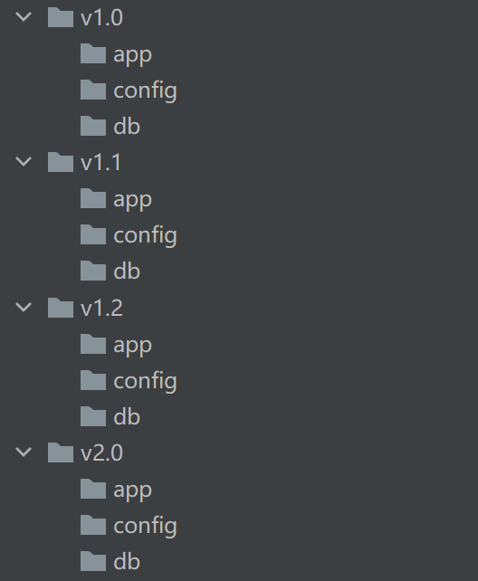
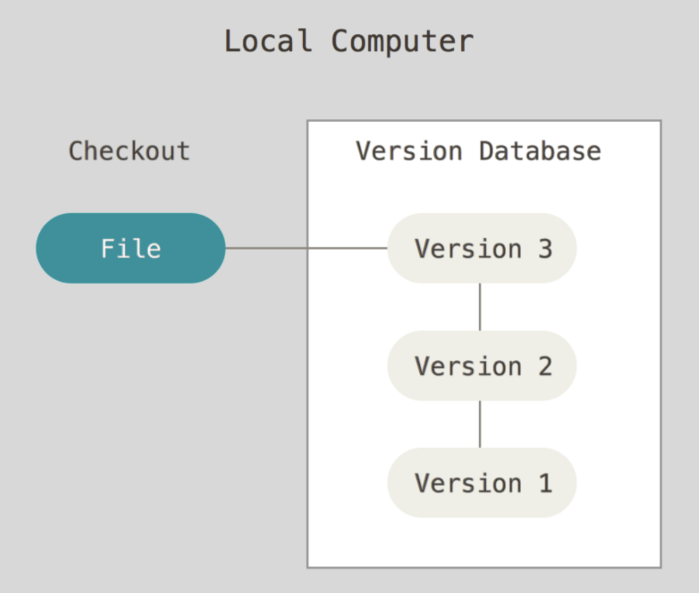
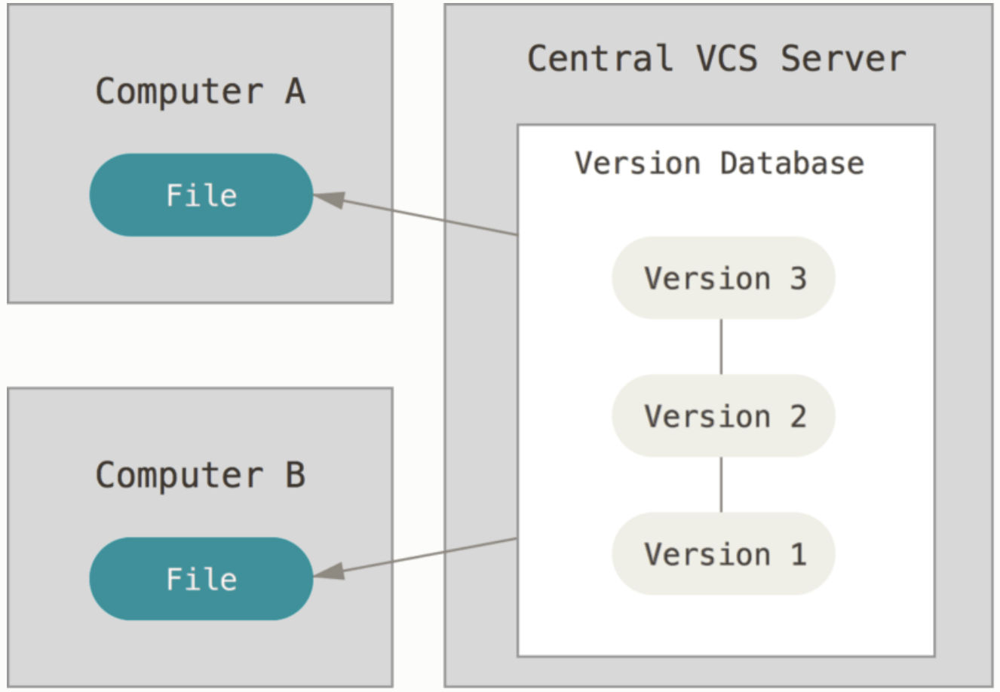
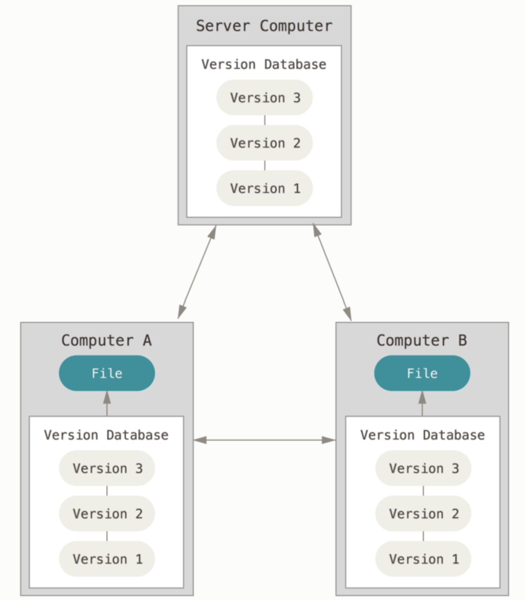

# 深入理解Git 

## 一、git基础

### 1、简介
**版本控制系统**

版本控制是一种记录一个或若干文件内容变化，以便将来查阅特定版本修订情况的系统。

**本地版本控制系统**

大多都是采用某种简单的数据库来记录文件的历次更新差异。
- 用目录拷贝区别不同版本
- 公共文件容易被覆盖
- 成员沟通成本高、代码集成效率低下

 

**集中化的版本控制系统**

有一个单一的集中管理的服务器，保存所有文件的修订版本，而协同工作的人们都通过客户端连到这台服务器，取出最新的文件或者提交更新。这么做最显而易见的缺点是中央服务器的单点故障。 如果宕机一小时，那么在这一小时内，谁都无法提交更新，也就无法协同工作。 如果中心数据库所在的磁盘发生损坏，又没有做恰当备份，毫无疑问你将丢失所有数据——包括项目的整个变更历史，只剩下人们在各自机器上保留的单独快照。 本地版本控制系统也存在类似问题，只要整个项目的历史记录被保存在单一位置，就有丢失所有历史更新记录的风险。
- 有集中的版本管理服务器
- 具备文件版本管理和分支管理能力
- 集成效率有明显的提高
- 客户端需要和服务器保持连接

**分布式版本控制系统**

客户端并不只提取最新版本的文件快照， 而是把代码仓库完整地镜像下来，包括完整的历史记录。 这么一来，任何一处协同工作用的服务器发生故障，事后都可以用任何一个镜像出来的本地仓库恢复。 因为每一次的克隆操作，实际上都是一次对代码仓库的完整备份。
- 服务端和客户端都有完整的版本库
- 脱离服务端之后客户端也可以管理版本
- 查看历史、版本比较等大多数操作，都不需要访问服务器

### 2、工作区和暂存区

### 3、给文件重命名

### 4、查看版本演变历史

### 5、gitk图形界面

### 6、.git目录

### 7、commit、tree和blob对象之间的关系

### 8、分离头指针

### 9、HEAD和branch

## 二、独自使用git的场景

### 1、删除不需要的分支

### 2、修改最新commit的message

### 3、修改旧commit的message

### 4、连续多个commit合并为一个

### 5、间隔的几个commit合并为一个

### 6、暂存区和HEAD文件的差异

### 7、工作区和暂存区文件的差异

### 8、暂存区文件恢复成与HEAD相同

### 9、工作区文件恢复成与暂存区相同

### 10、取消暂存区部分文件的更改

### 11、消除最近的几次提交

### 12、不同提交的指定文件的差异

### 13、删除文件

### 14、开发中添加临时任务

### 15、指定不需要git管理的文件

## 三、多人单分支场景

### 1、不同人修改了不同的文件

### 2、不同人修改了同一文件的不同区域

### 3、不同人修改了同一文件的同一区域

### 4、同时变更了文件名和文件内容

### 5、同一文件改成了不同的文件名

### 6、git集成使用禁忌
